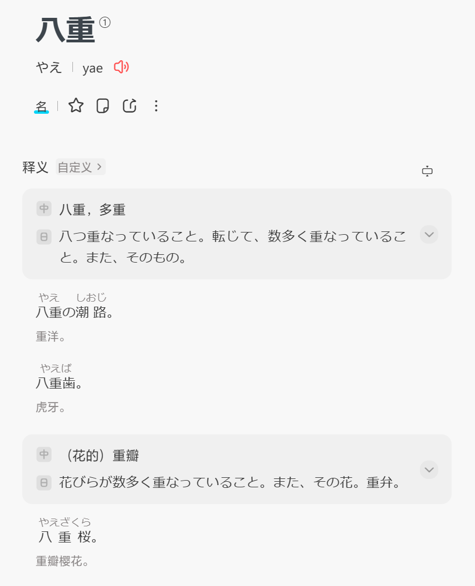
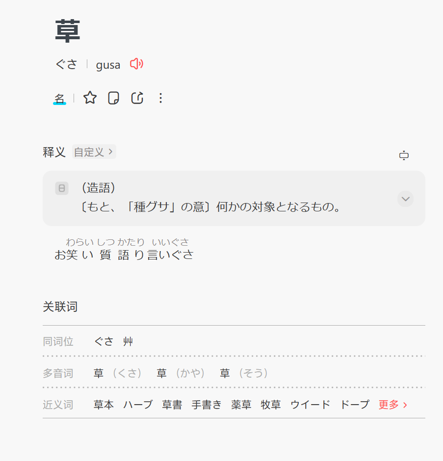
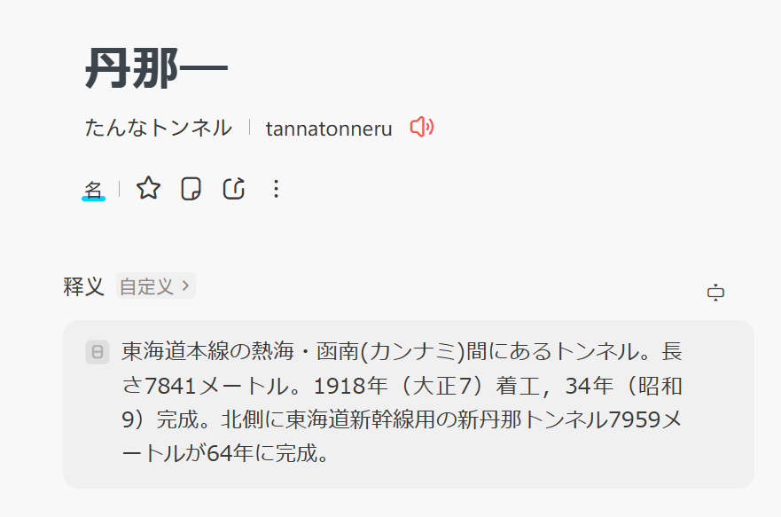
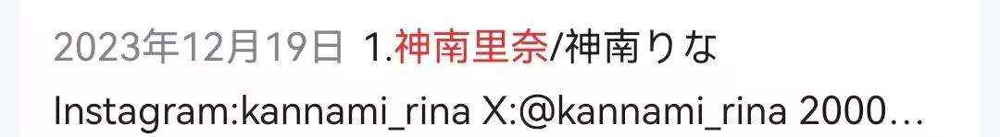
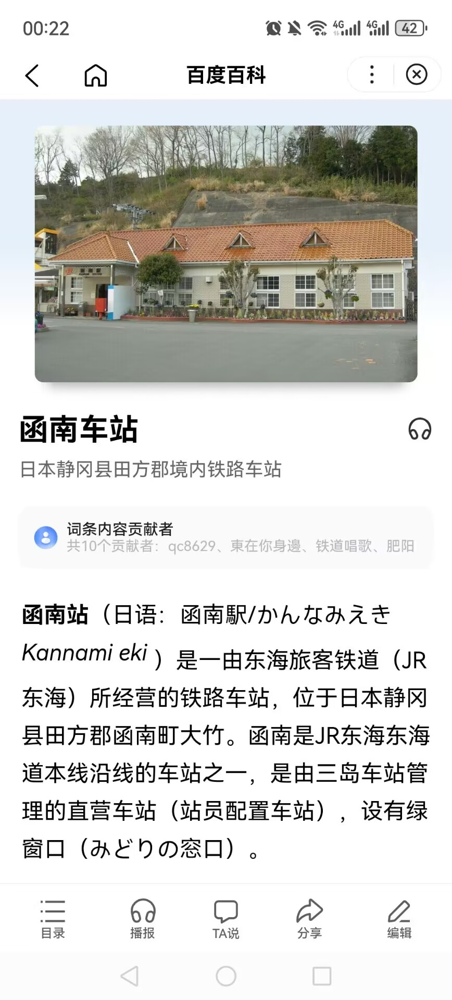
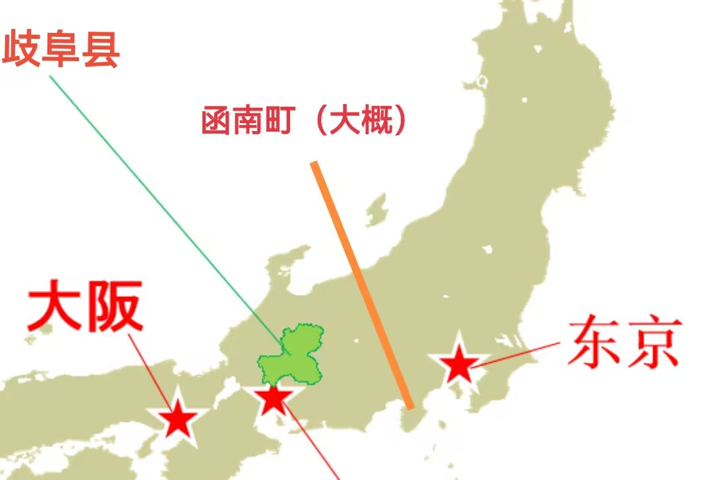

本页记录与HyFNz对《Girls Egg Dystopia》里面一些内容的猜测。

## ヤエグサ·カンナミ
### 2024/03/18
话说回来，你认为那个ヤエグサ·カンナミ现实锚到底是什么名字？我感觉这应该是个日文名，就像须贺阳太一样。  
  

  

*カンナミ查不到*  
  

这个拼出来是kanami对吧  

我：kannami  

也对，其实考虑到NAMI的话我一开始还以为是konami  

我：这片假名也不知道是取自现实还是捏他了什么，那个global database是整词  

会不会是这个  
  

我：道具的名字应该不会是现实人物吧  

哦不对，应该是神南，但这样一来为啥姓氏会出现在名字的位置上  

我：我明天去日本人名网查一下  

似乎确实是一个姓氏  
  
那就非常奇怪了  

我：外国人是把姓氏放后面  

日本也是吗？不会吧，须贺阳太的顺序并没有反。  

我：欧美那边，可能不是日本人  

这位看介绍是日本女优，而且里奈确实在日文里是常见名字。神南应该就是姓氏，但我在萌百上反正是找不到第二个姓这个的。  
  
我蠢了  

我：这个其实我看到了  

你觉得不太可能是吗  

我：毕竟是打开门的东西，应该不会是地点，可能性比较低。  

我有个想法，可能真是地名。  
目前整个系列出现的地区，一个是歧阜县，一个是东京霞关地区，还有就是这个存疑的函南町。  
这三个全是东海道那条线上的城市。  

我：如果真是这样，那前半是啥。八重草看上去是地名。

我怀疑就是哪个行政区划的地名  
  
中间那个星是名古屋  
我用百度地图查了一下，没查到前半是什么，应该不是地名了，估计是什么合成词。  

我：后半应该就是函南了。上面说的那个上面隧道1918年开始建，1934年完工，应该不是巧合。  
但是漫画上门应该是1936年造出来的。  

这个怎么说？  

我：只是时间上有点近。  
不对是1936年开始研究，1936年耀一郎去研究那个什么回旋加速器。  

钥匙比门晚两年半左右，从亚里香那儿可以判断至少门B在27年就存在。  
当然换个思维想，也许这地方是在艾弗雷特那边。  

我：有可能后半是日本，前半是艾弗雷特。  

也就是说最初有可能是耀一郎从横须贺跑到函南开了门（这俩地点也不远，横须贺就在东京下边），然后穿到那边的一个叫八重草什么的地方去了。  
三年后开发了钥匙，出于纪念目的就取了这个名字，合理合理。  
BC388出现的预言。  

我：bc480是哪一年？  

最早的一年。  

我：1936？  

既然是确立，那就是门A，也就是耀一郎打开的那道，应该是1940年之后。  

我：他在1937-1945这里任意一年都有可能创造了门，没说一定是他走那一年才发明出来，有可能是刻意等论文发布。  

这个倒不是大问题，这里的巧合在于480~460→388，72~92年间隔加到1927年恰好是1999~2019。  
亚里香是哪年走的来着？  

昭和92。这是2017还是2018？  

哦不对，忘了门两边时间不一样。  
也有可能两者根本没关系，BC388估计是独立事件，根据它产生的影响来看，可能本身内容就是计算出了陨石会降落的时间。  
感觉应该是得不出什么进一步结论了，其他的明天再说。  
