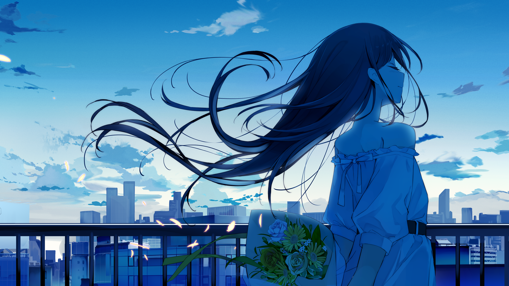

# 随手记·2

***

>你知道琥珀吗？  
>世间的事，就如同琥珀。  
>松脂滴落，包裹住虫子。  
>虫子没有做错什么，它只是出现在了应该出现的地方。  
>松脂也没有错，只是落到了它该落的地方。  
>可结果就是这样，美丽而又残忍。

年底的12月是如同噩梦一般的日子，9门考试中夹杂着课设让我怀疑这个学校安排时间的人是不是脑子出了点问题。成绩出来全是压线过有一门虽然不及格但补考过了，这就属于后话了。结果年二十八还在改课设图纸的我又一次觉得当初不该听老爸的“意见”选了个“好”学校“好”专业。

大年初一早晨的街道是如此冷清，呼啸的寒风仿佛刀片正撕裂着我的脸。我提着两袋垃圾走向老家小区门口的垃圾站，丢完马上就缩回了被炉里。正午人稍微多了起来，我望着街道上人来人往。有一家人出来玩耍，有情侣成对出门逛街，不过最显眼的还是我这种形单影只在街上游荡的人。我的视线落在一个背着一大串气球的老奶奶身上，一个小男孩正在选气球，旁边站着他的妈妈。我在想老奶奶为什么不在家与子孙其乐融融地洽谈，忽然鼻子一酸。那现在的我又在这里干什么呢，未来的我是不是有一天也会变成这样？我不知道，我买了两串糖葫芦就回了家。

从老家回到广州的那天晚上吃饭我和老爸聊了很多没有必要但可能有点用的废话。我说现在的大学里面有些制度未免太过离谱，全部人都在天天担心绩点够不够，这和卷高考没有半点区别。他说接受高等教育其实并不主要是你学多少知识，而是学跳脱出当前环境带来的惯性思维用新的角度去思考问题。我说你说得对，我觉得我成绩一般可能就是因为总是想问题太多，而且喜欢挑自己的毛病。他说你要是少打点游戏就挺好的，我现在也不想强迫你，以后你能将你现在自学的自己喜欢的东西带到工作里就最好了。我说放屁，当一个人对自己不喜欢的东西习以为常的时候周围的人才会认同你，这也就是你们眼里所谓的“成长”。

中午出去吃饭跟人瞎几把扯了几个小时。我说我不奢求自己能过得风流倜傥，只要不衣衫褴褛就行。突然聊到有没有女朋友，我说我觉得甜蜜而又青涩的恋爱就好像夏日里耀眼的太阳。我就像白化病人一样，不敢靠近灼热的阳光，因为太过刺眼。我能有几个知心朋友能在我消极的时候听我说会话就足够了。人要学会对自己温柔一点，不必追求完美，而是差强人意。

回到学校发现我的一个朋友不在了，莫名感到有些失落。然后又有一位朋友得了抑郁症，我忽然发现自己是如此渺小无力。我不是神仙，不是医学博士，我不明白我能为他做些什么。我能做的就只有听他诉苦，然后讲一些看上去苍白无力的话语。不知道这些话能不能为他派上用场，如果可以，我也希望能跑去他身边摸摸他的头，让他靠着我的肩膀大哭。或许，朋友就是这样一种存在吧。曾经有人评价过我，说我可能共情能力很强，经常能理解别人的感受。我不知道自己是否是这样，但可笑的是，这种能力现在已经被网络上某些人戏称为“圣母”了。

我说世界是装满宝石的宝石箱，所谓生存，就是与人争夺这些熠熠生辉的宝石。人们对这些宝石趋之若鹜，人人都勾心斗角，暗中倾轧。若不如此便会被社会所抛弃。而人生其实就像连续但不可导的函数，无人能预测其趋势，谁也不知道明天和意外哪个先到来。生活中充斥着大量幸福与不幸，被生活摧残的我们似乎也分辨不出来了。但有时候，这种不知道对于我，或者说对于我们未尝不是一种幸福。

2023.3.18夜