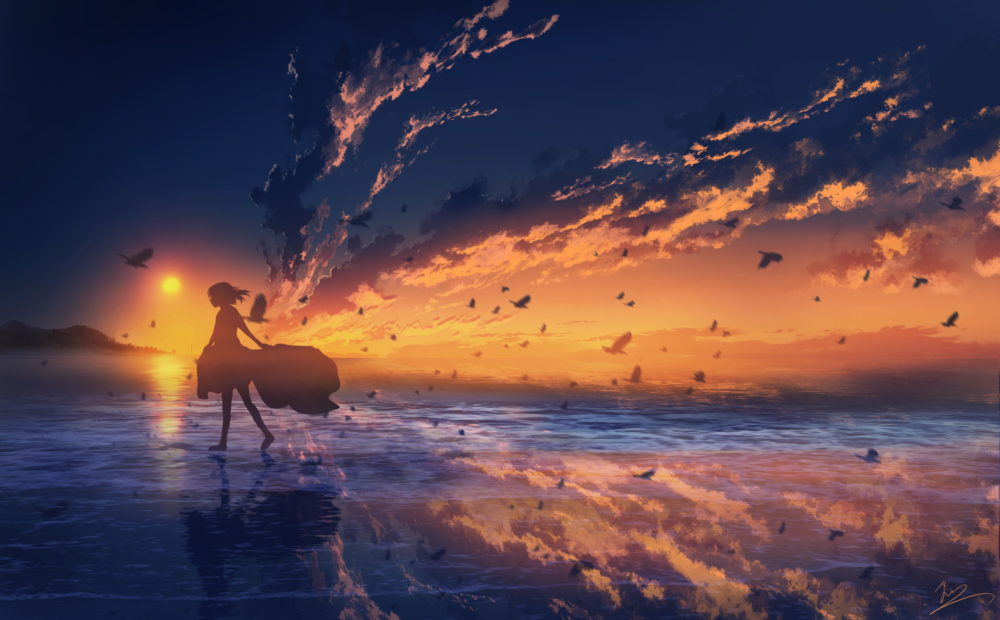

# 随手记·3

***

>日々私たちが過ごしている日常は、実は、奇跡の連続なのかもしれない。  
>我们所经历的每个平凡的日常，也许就是连续发生的奇迹。

整个三月和半个四月在我看来是那么漫长，毕竟这一个半月里发生了太多的事情。在这期间，我又看了一遍《没有明天的我们，在昨天相恋》，确实好看。我很喜欢这个故事，并为这本书背后的创作契机感到惋惜。当一位女性挚友透露寻死的念头时，作者自己却无法说出鼓励的话。他思考自己能为她做些什么，因此写了这本小说，想通过这个故事为她加油打气。只是，当这本书连载结束并获奖出版为文库本时，他请挚友阅读的愿望早已无法实现。

距离上一段话已经过去了5个月左右，这5个月里，我经历了一段两个人从相识、相知、相见、相好，最后相离的感情。毫无疑问，这段时间改变了我的人生轨迹。虽然面临着延毕的风险，但是也不见得是坏事。我望着操场上跑步的学生，他们仿佛在讴歌学生时代的青春，非常的耀眼。

***

我知道很多人的敏感并不是天生的。

只是后来经历了一段明明很笃定最后不得不放弃的关系，有过一个付出了努力却没有后来的故事，才逐渐变得敏感起来。因为害怕陷进那种困局，所以想要提前逃跑，其实挺容易理解的。可我仍然觉得，如果你已经有放弃的打算，那不妨把所有想法摊出来去拿一个明确的答案。

哪怕最后的答案还是无法继续下去，但至少「带着答案的离开」比「没有答案的逃跑」要体面得多。大概后来回忆中的「如果」和「可惜」也会少上许多。而更重要的是，无论你做了哪个选择，都能够在这个过程里慢慢明白，自己与「更好的自己」，以及「在意自己的人」之间还欠着多少距离。

有些人会让你成长，而有些人会给你陪伴。残酷的是，让你成长的人，总是要错过后来的那些你成熟了的时光。没办法，人和人之间的相遇就是这样的。好多时候我都在想，如果是现在的我，可能就不会那么脆弱敏感，不会在一段关系里有那么多让彼此难堪的时刻了。

但再怎么想，都改变不了过去。而且如果不是那样的我走过那么长的一段弯路，可能现在的我，也没办法很好的和人相处。长大是用教训换的，怀念的东西也可能是因为失去了才显得格外美好，人只能珍惜眼前的这一切。所以分别了也没关系，是那些经历让我成为了更好的人。这样想，每一段相遇与分离，其实并非毫无意义。

***

这就是我说的“不见得是坏事”。

暑假回家和老爸大吵一架，去医院查出中度焦虑，我不好评价。“回首以往，发现自己无论是想要或是不想要的，真正握到手中的事物屈指可数。而屡次在人生的十字路口做出最差的选择，使我感叹自己生命中所需要的好运从未到来。”简直是对我的人生最好的诠释。中国多数家长都不愿意承认自己在教育上犯下的错误，我爸也一样。当初坚持自己是对的，到后来发现错了之后又说要往前看，别回想之前错误的选择。我不流汗黄豆都憋不住了。但是就算回想又有什么用呢，确实是这样。

他说现在不再逼迫我，是好事。真到了这个时候，反而不知道做什么了。每天除了上课就是睡觉，精神药物的副作用就是如此强大。不知道从何时起我的脾气变得非常暴躁，看不惯一些人、看不惯一些事，在背后说别人坏话。曾经心中自己最厌恶的样子与自己的重叠度越来越高，最后发现还是活成了自己最讨厌的模样。我开始觉得自己恶心，又无力改变现状，那就沉默不语吧。这样至少可以避免伤害到一些人。

>“人终究还是会变得世俗，这是无法避免的事。”

人都是自私的，我有怀疑过是不是所谓的“放下助人情结，尊重他人命运”才是更好的选择，很多时候我们只能选择无可奈何。有的人在低谷摆烂，很可能是对人生真的没有期盼，并不是所有人都幸运到能拥有面对苦难的勇气。

《三日间的幸福》、《那年夏天，你打来的电话》和《夏天、烟火和我的尸体》都是想看的书，堆在书架上，是时候拿起来翻翻了。这些略带粗糙的纸张，摸起来有一种安心感。入秋的深夜，有一种迷人的美。多希望此刻做一个美梦，以此长眠不醒。

2023.9.12夜