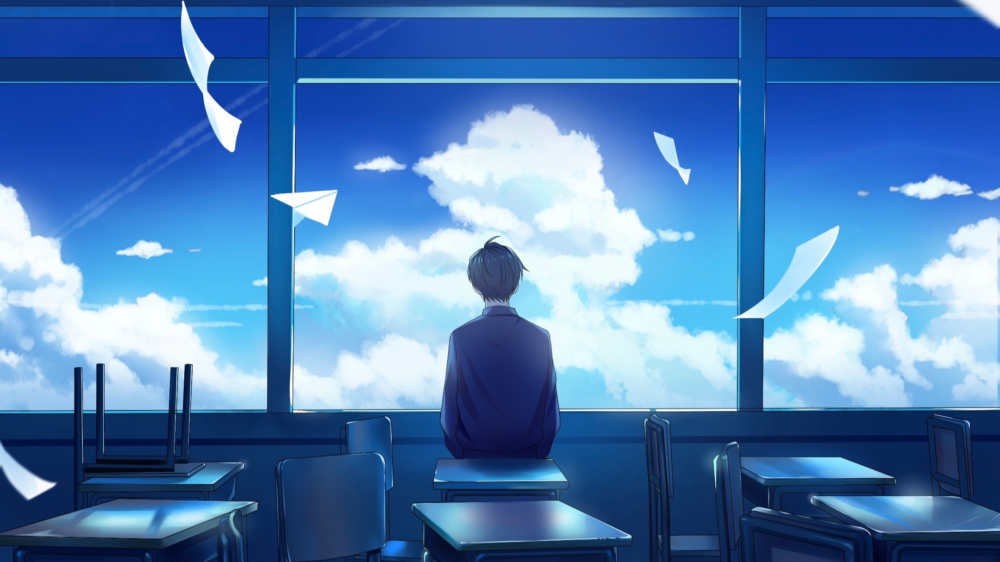

# 随手记·4

***

>きっと誰もが傷つきながら  
>谁都一样 都是在受伤时  
>心に鍵かけて泣いているんだろう  
>闭上自己的心扉哭泣着吧

三秋缒在《三日间的幸福》里写过：「笨蛋到死也治不好」。不过我宁愿乐观一点，将这句话改成「笨蛋到死之前就会治好」。

三秋缒说的笨蛋，是指那些认为自己没法获得幸福的人。实话说，我其实也是这类人中的一个，同时也是悲观主义者。虽然我时常觉得自己没法获得幸福，但我并不认为自己没资格得到幸福，我只是不知道方法。而现在的我，也懒得去寻找方法了。独自一人，也许比学一身社交辞令去左右逢源要轻松的多吧。

三秋缒是个黑童话作者，是一位擅长贩卖不幸与寂寞的轻小说家。可能就是因为这样我才特别中意他的小说吧。以前我总是去想有的没的，总想着幸福到底是什么样的东西。可实际到了这个年纪的时候，吃顿好的、全成就一款游戏、看本喜欢的书，物欲横流的社会里这些看上去都是小事都能让我们有种满足感，哪还有空去思考那么宏大的东西？

>いつも強がって 自分を奮い立たせ  
>一直故作坚强 让自己奋起直追  
>つまづいた分だけ 少しずつ 強くなれるよ  
>在失足倒地后 慢慢坚强起来

莫言说：所有伤害你的人都是故意的。

他在伤害你的时候就已经权衡利弊，他会不断的对比，然后最后选择伤害你。因为伤害你，他付出的代价最小，并且会获得更大的利益。利益才是人类交往的根本，当你不能给对方带来好处的时候，人性这个东西，不可言，不可研，不可验。你和任何人的关系，其实并不取决于你对别人有多好，而是取决于你的强弱，手上筹码的多少。

这就是真相，残酷却很真实。

总有一些人在别人的善良忍让中脸皮越来越厚，得寸进尺，贪心不足。一味的埋头做好人，毫不利己，专门为人牺牲自己去迎合别人，这不是善良，这是病得治。别让宽容成为纵容，别让忍让成为懦弱，别让包容成为无能。无论你在谁面前，只要你不欠他的，就没必要唯唯诺诺。

理性的薄情和无情才是生存的利器。

你越是做事果断，我行我素，不服就干，就越有人欣赏你，你越是老实善良，百依百顺，胆小怕事，就越有人欺负你。你觉得自己是在顾全大局，做牺牲的好人，可实际上，并没有多少人会真的想去感谢你，他们只会觉得你傻，你好欺负，你活该。

不合脚的鞋趁早丢掉，不合拍的人趁早远离。

>生きていく意味を見出すことが出来たなら  
>若能找到活下去的意义  
>描く未来は 君から始まる勇気  
>从中描绘出的未来 便是源自于你的勇气

生母已经整8个月没有打电话过来了，不闻不问，反正也习惯了。她不打来我肯定也不会打过去的。但我想不明白老爸为什么总是让我打电话过去，我觉得有些好笑，凭什么要我打电话而不是她打？一直忍到过年回老家，我终于忍不住对老爸发火，爷爷出手制止才结束这场闹剧。说了些很难听的话，虽然不是我的本意。至今为止他依旧把我当小孩，家里的事什么也不和我说擅自做决定，道理我都懂，我只是不愿被蒙在鼓里。

争吵的结果在我的意料之中，我也没多惊讶。反正和老爸两个人过下去也没什么不好的。说实话，时常会失眠整夜都睡不着，年后临走前爷爷对我说让我坚强点，差点让我眼泪掉下来。

>生きていく意味を見出すことが出来たなら  
>若能说出活下去的意义  
>昨日までの自分を越えられるはず  
>就一定会超越昨日的自己

换电脑之前，买了很多很不错的游戏，等着换电脑就能玩。尼尔机械纪元、只狼、黑魂3……等到真换了电脑之后，反而都不想玩了，我打开了是个电脑都能带的动的游戏。有人调侃我：“你买i9-13900HX和RTX4060就玩这个？”我面对屏幕笑了一下，不知道说什么好。小时候我看我表姐打英雄联盟很厉害，心想以后我要是有台高配电脑，我做梦都能笑醒，而且也一定能成为游戏高手。

我父母那代人教育小孩，就像莽夫玩魂系游戏，加点只给身体健康和学习成绩，从来不给精神加点。有人说，童年越缺什么，长大后就越渴望什么。童年如果灵魂被忽略，成年后就会成为魂淡。再难的魂系游戏，都没有人生难。

拿到新电脑之后我没有笑醒，我盯着看了很久，发现小时候的很多细节我已经想不起来了。整理文件的时候我发现了自己一个月之前写的代码，虽然能运行而且能再优化，但是我也不想再改了。想了想，这不就是我的人生吗，复杂的绕了很大一圈，最后还是勉强活着。

如果说童年是10岁以前，那么现在童年只占我人生的二分之一。以后会是三分之一、四分之一……我站在四维时空的时间轴看着十年前的小朋友，在离他越来越远之前，我想多陪他玩一玩，多满足一下他的愿望。我想和记忆中那个哭的很伤心的小朋友和解，想对他说一句：你看，你想要的东西，现在都有了。

>繋がる空の下 さあ自分らしく進もう  
>彼此相连的青空之下 来吧 用自己独有的方式前进  
>始まりの詩贈るよ 歩き出す君へ  
>将这起始的诗篇 赠与迈出步伐的你

欲买桂花同载酒，终不似，少年游。

2024.3.6夜